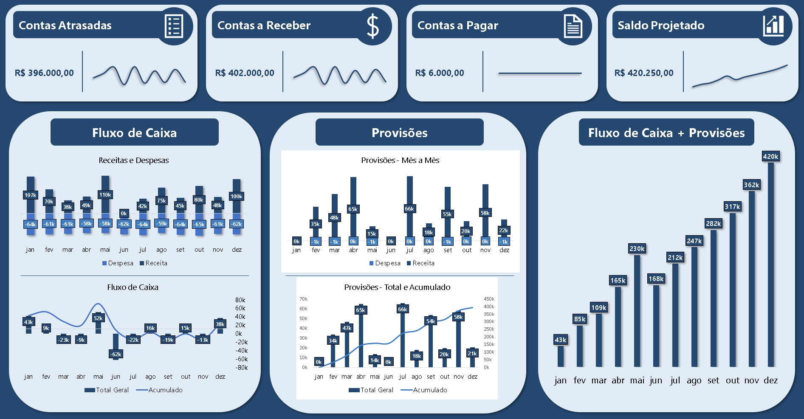

# 💸 Dashboard de Fluxo de Caixa Gerencial & Projeção de Liquidez (2024)

## 📌 Sobre o Projeto
Este projeto apresenta um **dashboard de Fluxo de Caixa (DFC)** interativo desenvolvido no **Microsoft Excel**. Seu principal objetivo é modelar a **liquidez futura** da empresa (Regime de Caixa), segregando o histórico **Realizado** das **Provisões** (Contas Pendentes) e entregando o **Saldo Total Projetado** (R$ 420.250,00) como métrica central.

---

## 🛠️ Ferramentas e Técnicas Utilizadas
- **Microsoft Excel** (Modelagem Avançada e Visualização)
- **Power Query** (Tratamento inicial e importação de dados)
- **Tabelas Dinâmicas** (Uso de **3 TDs** centrais para segregar a análise)
- **Cálculos Avançados em TD:** Implementação de **Item Calculado/Campo Calculado** para KPIs de dívida em valor absoluto.
- **`PROCX` e Fórmulas `SE`** (Para automação da Base de Lançamentos e controle de prazo).

---

## 📂 Estrutura do Repositório
- `Dashboard_Fluxo_de_Caixa.xlsx` → Arquivo principal do relatório.
- `Fluxo_de_Caixa.png` → Imagem de pré-visualização do dashboard.
- `csv_fluxo_de_caixa.txt` → Arquivo de texto contendo a base de dados em formato CSV para importação.
- `README.md` → Documentação detalhada do projeto.

---

## 📑 Preparação e Modelagem da Base de Dados

### I. Arquitetura e Limpeza (Passos 1 a 3)
- **Base de Lançamentos:** Importada e tratada via **Power Query** (Passo 1).
- **Estrutura Mestra:** Criação da planilha **`Referências`** (Passo 2) para padronizar contas.
- **Validação:** Campo `Conta` transformado em **intervalo nomeado** para **Validação de Dados** na Base de Lançamentos (Passo 3).

### II. Colunas Condicionais e Lógica de Sinais (Passos 4 a 10)
- **Automação de Dados:** Criação das colunas `Categoria`, `Transação`, `Prazo p/ pagamento`, `Atraso` e `Registro de Valor` (Passo 4).
- **Extração e Status:** Uso de **`PROCX`** (Passo 5) e fórmulas **`SE`** para calcular o prazo (Passo 6) e status (`Atraso` / `No Prazo` - Passo 7).
- **Tratamento de Sinais:** Fórmula `SE` no **`Registro de Valor`** para **negar despesas** (Passo 8).
- **Visualização e Liquidez:** Aplicação de **Formatação Condicional** (Passo 9) e adição da coluna **`Saldo`** (Passo 10).

---

## 📊 Arquitetura de Análise e Tabelas Dinâmicas (Passos 11 a 20)

### I. Configuração dos Relatórios Auxiliares
11. **Relatório de Contas (Base Visual):** Criado com Tabela Dinâmica e `Soma do Registro de Valor`, sendo a base interativa (Slicers/Linhas do Tempo) do Dashboard.
12. **Planilha Central:** Criação da planilha **`Análises`** para abrigar todas as TDs e cálculos (Passo 12).

### II. Módulos de Cálculo e Projeção
13. **TD Fluxo Realizado (Histórico):** Criada para o histórico de caixa (`Filtro: Realizado = Sim`).
14. **Tabelas de Referência 1:** Criadas as tabelas auxiliares de **Receitas e Despesas** e **Fluxo de Caixa Total** (para o Acumulado Realizado).
15. **TD Provisões (Futuro):** Criada para o fluxo futuro (`Filtro: Realizado = Não`).
16. **Tabelas de Referência 2:** Criadas as tabelas auxiliares de **Contas a Pagar/Receber** e **Total Pagar/Receber**.

### III. Consolidação e Dashboard Final
17. **Tabela Mestra:** Criação da Tabela de **`Cálculo Acumulado`** que une o Acumulado Realizado e o Acumulado de Provisões.
18. **Montagem do Dashboard:** Inserção dos **5 Gráficos** referentes aos três painéis (FC, Provisões, FC + Provisões).
19. **KPIs Dinâmicos:** Criação de TDs auxiliares para extrair os valores únicos de **Contas Atrasadas, a Receber, a Pagar** e **Saldo Projetado**, ligando-os aos cards do Dashboard.
20. **Organização Final:** Ocultação das guias **`Referências`** e **`Paleta de Cores`**.

---

## 🎮 Interatividade
A interatividade é implementada na planilha **`Relatório de Contas`**.

**Propósito:** O Relatório de Contas utiliza **Slicers** e **Linhas do Tempo** para permitir ao usuário:
- Filtrar por critérios de gestão: `Atraso`, `Realizado`, `Forma Pagamento` e `Categoria`.
- Comparar o resultado do **Regime de Caixa** (`Data Pagamento`) versus o **Regime de Competência** (`Data Lançamento`).

---

## 🚀 Como Usar
1. Baixe o arquivo e abra-o no Excel.
2. Utilize os Slicers para segmentar as análises e identificar gargalos de caixa.

---

## 📌 Observações
- Todos os dados são **simulados** para fins de portfólio.
- Projeto desenvolvido para demonstrar proficiência em **Modelagem Financeira** e **Business Analytics**.
